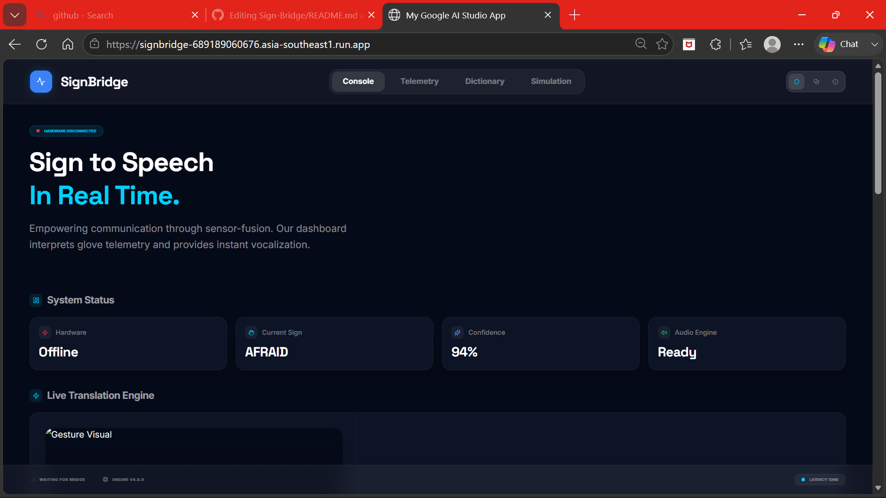
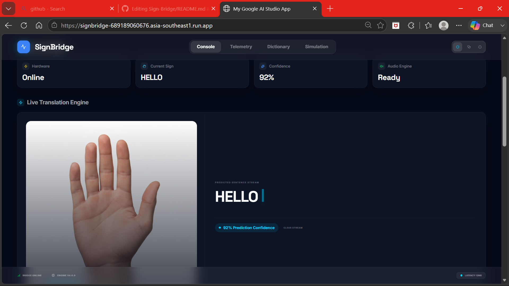
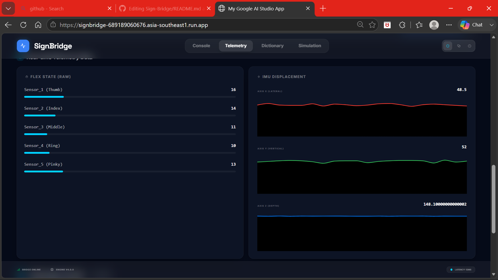
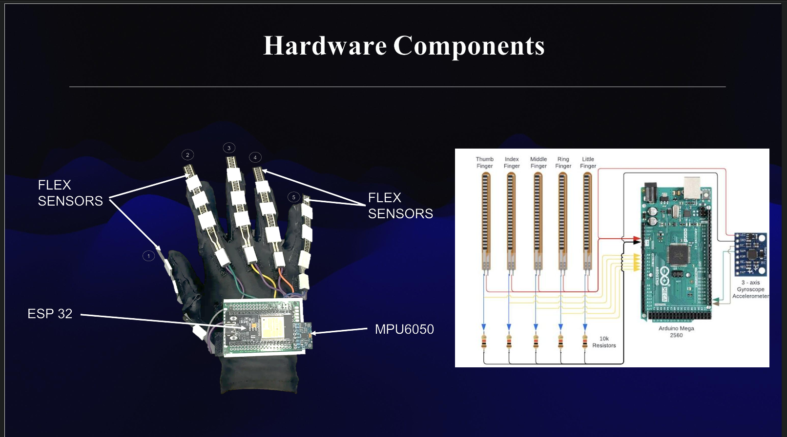
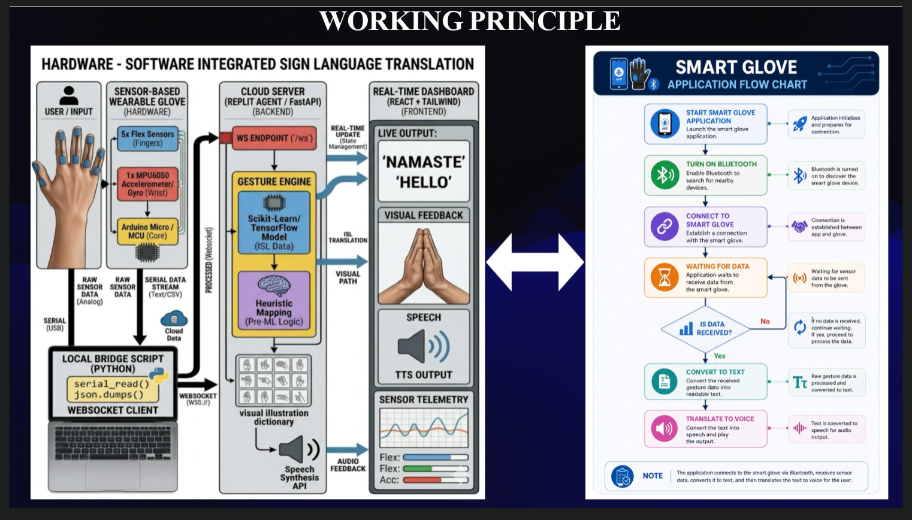

# 🤟 Sign Language Translation Gloves

> A smart IoT-based wearable glove that translates sign language gestures into readable text and speech through a real-time web dashboard, enabling seamless communication between hearing-impaired individuals and non-sign language users.

---

## 📌 Project Overview

Sign language is one of the primary communication methods for people with hearing and speech impairments. However, many people do not understand sign language, creating communication barriers.

The **Sign Language Translation Gloves** address this problem by detecting finger movements and hand orientation using sensors mounted on a glove. An ESP32 processes the sensor data, recognizes predefined gestures, and sends the translated text to a **live web dashboard** over Wi-Fi. The dashboard displays the translated message and can also speak it aloud using browser-based Text-to-Speech.

---

## 🎯 Objectives

- Translate sign language into readable text.
- Enable real-time communication.
- Create an affordable assistive technology.
- Display translated messages on a web interface.
- Convert translated text into speech.

---

# ✨ Features

- 🤟 Real-time gesture recognition
- 🧤 Flex sensor-based finger tracking
- 📐 Hand orientation detection using MPU6050
- 🌐 ESP32-hosted web dashboard
- 🔊 Browser Text-to-Speech
- 📱 Mobile and PC compatible
- 📡 Wi-Fi communication
- ⚡ Low-cost design
- 🔄 Expandable gesture database

---

# 🛠 Hardware Components
```
 -Component                               -Quantity 
-|-----------------------------|--------------------|
-| ESP32 Development Board                 | 1 |
-| Flex Sensors                            | 5 |
-| MPU6050 Accelerometer & Gyroscope       | 1 |
-| Gloves                                | 1 Pair |
-| Li-ion Battery                          | 1 |
-| Connecting Wires                    | As Required |
-| Breadboard/PCB                          | 1 |
```
---

# 💻 Software Used

- Arduino IDE
- HTML
- CSS
- JavaScript
- Embedded C++
- ESPAsyncWebServer Library
- WiFi Library

---

# ⚙️ Working Principle

1. The user performs a hand gesture.
2. Flex sensors detect finger bending.
3. MPU6050 measures hand movement and orientation.
4. ESP32 collects all sensor values.
5. Sensor values are compared with stored gesture patterns.
6. Matching text is generated.
7. ESP32 hosts a web dashboard.
8. The translated message is sent instantly to the dashboard.
9. Browser Text-to-Speech reads the translated message aloud.

---

# 📊 System Architecture

```
      Hand Gesture
           │
           ▼
 ┌───────────────────┐
 │ Flex Sensors (5)  │
 └───────────────────┘
           │
           ▼
 ┌───────────────────┐
 │     MPU6050       │
 └───────────────────┘
           │
           ▼
 ┌───────────────────┐
 │      ESP32        │
 │ Gesture Detection │
 └───────────────────┘
           │
      Wi-Fi Network
           │
           ▼
 ┌───────────────────┐
 │ Web Dashboard     │
 │ Text Display      │
 │ Text-to-Speech    │
 └───────────────────┘
```

---

# 📂 Project Structure

```
Sign-Language-Translation-Gloves/
│
├── ESP32_Code/
│   ├── SignLanguageGlove.ino
│
├── Web_Dashboard/
│   ├── index.html
│   ├── style.css
│   ├── script.js
│
├── Hardware/
│   ├── Circuit_Diagram.png
│   ├── Connections.pdf
│
├── Images/
│   ├── Prototype.jpg
│   ├── Dashboard.png
│   ├── Working.jpg
│
├── Documentation/
│   ├── Project_Report.pdf
│   ├── Presentation.pptx
│
├── README.md
└── LICENSE
```

---

# 🚀 Installation

### Clone Repository

```bash
git clone https://github.com/adikr23/Sign-Bridge.git
```

# 🌐 Web Dashboard

The dashboard provides:

- Live translated text
- Conversation history
- Text-to-Speech
- Responsive design
- Accessible from smartphones and computers

---

# 📸 Project Images

## Project Images


  

  


# 📹 Demo

https://1drv.ms/v/c/e697cffa4919490f/IQDQ62Pk6RQ3Ra34xLtu9-n5AekCwODxfg1NJd_27Z8mjRo?e=hQ3tUK

---

# 🔮 Future Scope

- AI-based gesture recognition
- Continuous sentence translation
- Indian Sign Language support
- American Sign Language support
- Cloud synchronization
- User authentication
- Mobile App
- Gesture learning mode
- Translation history
- Multi-language support

---

# 🎓 Applications

- Schools
- Hospitals
- Public Services
- Smart Healthcare
- Banks
- Customer Support
- Government Offices
- Assistive Technology

---

# ✅ Advantages

- Affordable
- Portable
- Easy to use
- Real-time translation
- Wireless
- Improves accessibility

---


# 👨‍💻 Author

**Aditya Kumar**

B.Tech Electronics and Communication Engineering

Techno Main Salt Lake

Kolkata, India

---

## ⭐ Support

If you found this project useful, please consider giving it a **Star ⭐**.

It motivates me to build more open-source embedded systems and IoT projects.

---

*"Technology should remove barriers, not create them."*
